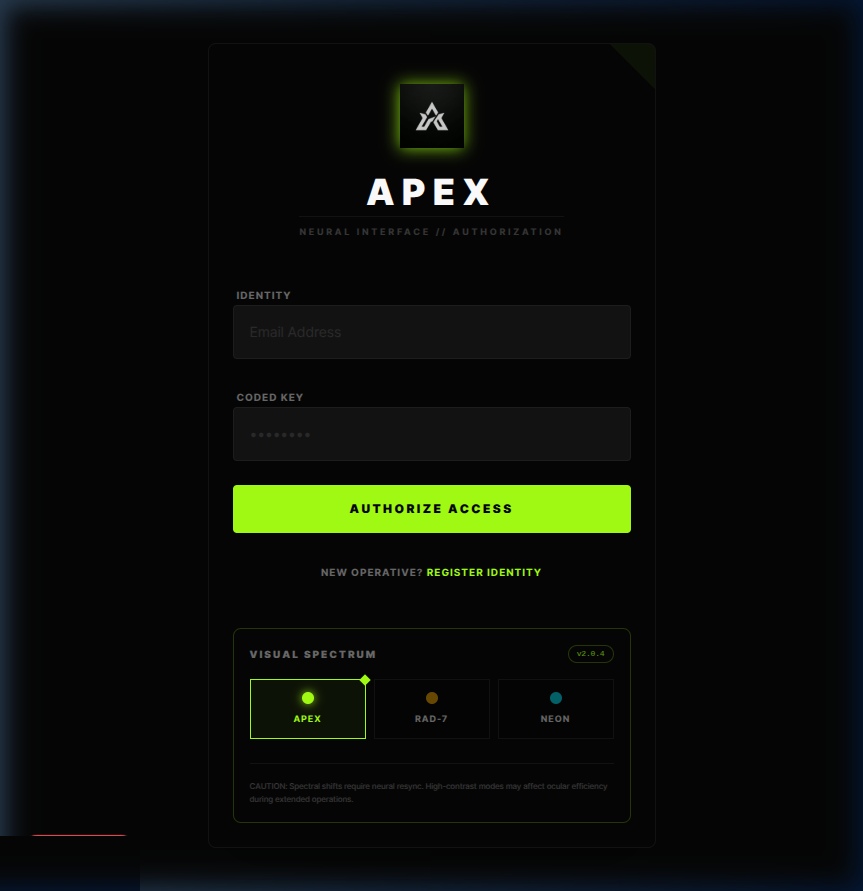
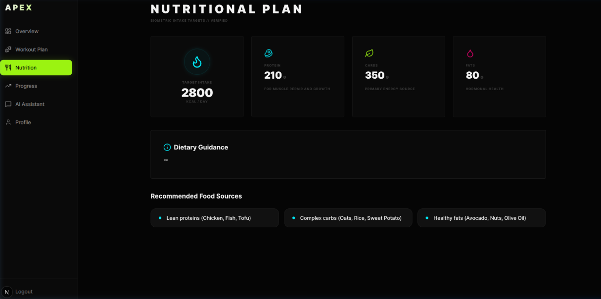
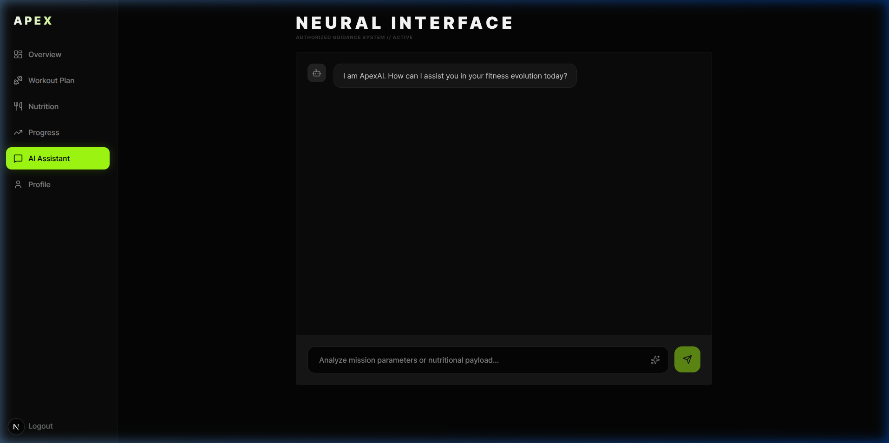

<div align="center">

# A P E X A I

### *Neural Fitness Intelligence Platform*

**AI-powered workout generation • Precision nutrition • Real-time biometric telemetry**

[](https://nextjs.org/)
[](https://fastapi.tiangolo.com/)
[](https://openai.com/)
[](LICENSE)

</div>

---

## What is ApexAI?

ApexAI is a **full-stack, AI-integrated fitness platform** that delivers personalized workout protocols, precision nutrition targets, and an intelligent chat assistant — all wrapped in a premium, military-grade dark UI.

It uses **OpenAI GPT-4o-mini** (with a local **Llama 3** fallback via Ollama) to generate adaptive plans based on your biometric profile: age, gender, weight, height, and fitness goals.

---

## Screenshots

<div align="center">

### Neural Authorization



*Secure authentication with JWT tokens and a multi-theme Visual Spectrum selector*

---

### Nutritional Plan



*AI-calculated calorie and macro targets with dietary guidance*

---

### AI Assistant — Neural Interface



*Context-aware fitness assistant with image-based meal analysis (Neural Vision Protocol)*

</div>

---

## Key Features

| Feature | Description |
|---|---|
| **AI Workout Plans** | Personalized 4-week progressive overload protocols generated by GPT-4o-mini |
| **Precision Nutrition** | Calorie and macronutrient targets calculated from your biometric profile |
| **AI Chat Assistant** | Context-aware fitness Q&A with multi-turn conversation memory |
| **Neural Vision** | Snap a photo of your meal → instant nutritional analysis |
| **Progress Tracking** | Log workouts, track weight, and visualize biometric trends over time |
| **Multi-Theme UI** | 3 premium visual spectrums: Apex Core, Hazard State, Void Protocol |
| **Biometric Sync** | Integration bridge for Garmin, Whoop, and Apple Health devices |
| **Stealth HUD** | Non-intrusive tactical status overlay with auto-fade |

---

## Tech Stack

| Layer | Technology |
|---|---|
| **Frontend** | Next.js 14, React, TypeScript, Tailwind CSS |
| **Backend** | FastAPI (Python), SQLAlchemy ORM |
| **Database** | SQLite (dev) / PostgreSQL (prod) |
| **AI Engine** | OpenAI GPT-4o-mini + Llama 3 (Ollama fallback) |
| **Auth** | JWT (JSON Web Tokens) with bcrypt hashing |
| **State** | Zustand (high-frequency biometric telemetry) |
| **Deployment** | Docker + Docker Compose |

---

## Getting Started

### Prerequisites

- **Node.js** 18+
- **Python** 3.10+
- **OpenAI API Key** ([get one here](https://platform.openai.com/api-keys))

### 1. Clone the Repository

```bash
git clone https://github.com/YOUR_USERNAME/ApexAI.git
cd ApexAI
```

### 2. Configure Environment

Create a `.env` file in the project root:

```env
DATABASE_URL=sqlite:///./apex.db
OPENAI_API_KEY=your_openai_api_key_here
SECRET_KEY=your_jwt_secret_key
ALLOWED_ORIGINS=http://localhost:3000
OLLAMA_URL=http://localhost:11434/api/chat
```

### 3. Start the Backend

```bash
cd backend
pip install -r requirements.txt
cd ..
python3 -m uvicorn backend.main:app --reload --port 8000
```

### 4. Start the Frontend

```bash
cd frontend
npm install
npm run dev
```

### 5. Open the App

Navigate to **[http://localhost:3000](http://localhost:3000)** and register a new account.

---

## Docker (Optional)

```bash
docker-compose up --build
```

This will spin up both the frontend and backend services automatically.

---

## Project Structure

```
ApexAI/
├── frontend/              # Next.js 14 application
│   ├── src/
│   │   ├── app/           # App router pages (dashboard, login, etc.)
│   │   ├── components/    # Reusable UI components
│   │   ├── context/       # React context providers
│   │   ├── store/         # Zustand state management
│   │   └── lib/           # API client and utilities
│   └── public/            # Static assets (favicon, logo)
│
├── backend/               # FastAPI application
│   ├── routers/           # API route handlers
│   ├── models.py          # SQLAlchemy database models
│   ├── schemas.py         # Pydantic validation schemas
│   ├── auth.py            # JWT authentication logic
│   └── database.py        # Database engine configuration
│
├── ai/                    # AI recommendation engine
│   └── recommender.py     # GPT-4o-mini + Llama 3 integration
│
├── docs/screenshots/      # Application screenshots
├── docker-compose.yml     # Container orchestration
└── .env                   # Environment configuration
```

---

## AI Architecture

```
User Request
     │
     ▼
┌─────────────┐     ┌──────────────┐     ┌─────────────────┐
│  FastAPI     │────▶│  GPT-4o-mini │────▶│  Structured     │
│  Router      │     │  (Primary)   │     │  JSON Response   │
└─────────────┘     └──────────────┘     └─────────────────┘
                          │ fail
                          ▼
                    ┌──────────────┐
                    │  Llama 3     │
                    │  (Ollama)    │
                    └──────────────┘
                          │ fail
                          ▼
                    ┌──────────────┐
                    │  Static      │
                    │  Fallback    │
                    └──────────────┘
```

The system uses a **3-tier fallback strategy**: GPT-4o-mini → Llama 3 (local) → Static Elite Protocol. This ensures the platform **never shows an empty state**, even when all AI services are offline.

---

## License

This project is licensed under the **MIT License** — see the [LICENSE](LICENSE) file for details.

---

<div align="center">

**Engineered by Arjun** · v5.4 // Neural Collective

*Built with passion and way too much caffeine*

</div>
